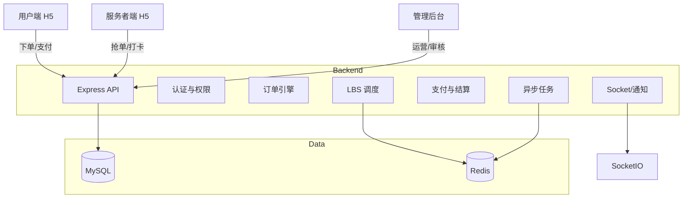

# 小帮手 (XiaoBangShou) — O2O 喂猫遛狗陪诊平台

[](https://vuejs.org/)
[](https://nodejs.org/)
[](https://expressjs.com/)
[](https://www.mysql.com/)
[](https://redis.io/)
[](https://www.docker.com/)
[](https://kubernetes.io/)

> 一个面向本地生活服务的全链路 O2O 履约系统，覆盖用户端、服务者端、管理后台与后端核心能力。

📺 演示视频 (Demo)

遛狗预约下单服务演示


小帮手后台管理系统demo演示


---

## 🛠 技术栈全景 (Tech Stack)

### 🖥 前端架构 (Frontend)
- **核心框架**: [Vue 3](https://vuejs.org/) (Composition API) + [Vite 5](https://vitejs.dev/)
- **状态管理**: [Pinia](https://pinia.vuejs.org/)
- **UI 组件库**:
  - 移动端: [Vant 4](https://vant-contrib.gitee.io/vant/) (轻量级、高性能)
  - 管理后台: [Element Plus](https://element-plus.org/) + [TailwindCSS](https://tailwindcss.com/)
- **数据可视化**: [ECharts 5](https://echarts.apache.org/) (运营报表)
- **通信协议**: Axios (REST) + Socket.io-client (WebSocket)
- **即时通讯**: 腾讯云 IM SDK (TIM)

### ⚙️ 后端架构 (Backend)
- **运行时**: [Node.js 18+](https://nodejs.org/) (LTS)
- **Web 框架**: [Express 4](https://expressjs.com/)
- **数据库**: [MySQL 8.0](https://www.mysql.com/) (Relational Data)
- **缓存与消息队列**:
  - [Redis 7](https://redis.io/) (分布式锁、缓存)
  - [BullMQ](https://docs.bullmq.io/) (异步任务队列、延时队列)
- **实时引擎**: [Socket.io](https://socket.io/) (双向通信、状态同步)
- **安全机制**:
  - JWT (无状态认证)
  - Helmet (HTTP 头安全)
  - Express-Rate-Limit (防爆破/限流)
- **日志系统**: Winston (分级日志)

### ☁️ 基础设施与部署 (Infra & DevOps)
- **容器化**: [Docker](https://www.docker.com/) + Docker Compose
- **编排**: [Kubernetes (K8s)](https://kubernetes.io/) (Production Ready)
- **网关/代理**: [Nginx](https://nginx.org/) (反向代理、负载均衡)
- **云服务集成**:
  - **地图服务**: 高德地图 API (LBS、路径规划、距离计算)
  - **支付网关**: 支付宝 SDK (App 支付、退款)
  - **短信/验证**: 阿里云 SMS & Captcha

### 🔧 开发工具 (Dev Tools)
- **版本控制**: Git
- **包管理**: NPM

---

## 一句话概览

小帮手通过 **LBS 智能调度 + 订单全流程实时同步 + 资金担保结算** 构建家政服务闭环，兼顾 C 端体验、B 端效率与平台治理能力。

---

## 适用场景与商业价值

- O2O平台搭建（陪诊、宠物照护、跑腿）
- 城市级服务调度系统
- SaaS 化服务履约中台

价值体现：
- **匹配效率提升**：基于距离与资质综合排序，提高首单响应速度
- **履约透明化**：服务节点打卡 + 实时状态同步
- **资金安全**：担保交易与分账结算

---


## 系统架构总览



---

## 模块级架构（技术视角）

### 核心服务
- 订单查询与聚合：`backend/src/services/OrderQueryService.js`
- 订单创建与计价：`backend/src/services/OrderCreationService.js` + `PricingEngine.js`
- 订单状态变更：`backend/src/services/OrderStatusService.js`
- 支付与取消：`backend/src/services/OrderPaymentService.js`
- 周期订单：`backend/src/services/RecurringOrderService.js`
- 订单治理引擎：`backend/src/services/orderEngine.js`
- 结算扫描引擎：`backend/src/services/settlementEngine.js`

### 事件与通知
- 事件总线：`backend/src/utils/eventBus.js`
- 事件订阅：`backend/src/subscribers/orderSubscriber.js`
- 通知服务：`backend/src/services/NotificationService.js`
- Socket 通道：`backend/src/utils/socket.js`

### 安全与合规
- JWT 认证：`backend/src/middlewares/auth.js`
- 请求限流：`backend/src/app.js`（rateLimit）
- 数据脱敏：`backend/src/utils/masking.js`

---

## 核心业务流程

### 订单生命周期（状态机）

```
10 待支付 -> 0 待接单 -> 1 已接单 -> 11 已到达 -> 2 服务中 -> 3 已完成 -> 5 已评价
                       \-> 4 已取消
                       \-> 12 取消协商中
```

### 履约链路
1. 用户下单 → 系统计价 → 订单生成
2. 支付完成 → 订单进入待接单池
3. 服务者接单 → 到达打卡 → 开始服务 → 完成上传
4. 用户确认 → 结算到账 → 评价闭环

---

## 数据模型概览

核心表（简化）：
- `users` 用户
- `providers` 服务者档案
- `orders` 订单主表
- `order_reviews` 评价
- `order_schedules` 周期单排期
- `recurring_orders` 周期订单主表
- `wallet_records` 钱包流水

表结构定义：`database/schema.sql`

---

## 目录结构

```
xiaobangshou/
├── backend/            后端服务
├── mobile-user/        用户端 H5
├── mobile-provider/    服务者端 H5
├── admin-web/          管理后台
└── database/           SQL 脚本
```

---

## 快速启动（Docker 推荐）

### 1) 环境要求
- Docker Desktop 或 Docker Engine
- Docker Compose

### 2) 一键启动
```bash
# 构建并启动所有服务（后端 + 3个前端 + MySQL + Redis）
docker-compose up --build -d
```

### 3) 访问服务
- 用户端 H5: `http://localhost:8081`
- 服务者端 H5: `http://localhost:8082`
- 管理后台: `http://localhost:8080`
- 后端 API: `http://localhost:3000`

---

## 快速启动（本地开发）

### 1) 环境要求
- Node.js 18+
- MySQL 8.0
- Redis

### 2) 初始化数据库
```bash
mysql -u root -p xiaobangshou < database/schema.sql
```

### 3) 启动后端
```bash
cd backend
npm install
npm run dev
```

### 4) 启动前端
```bash
cd mobile-user
npm install
npm run dev
```

```bash
cd mobile-provider
npm install
npm run dev
```

```bash
cd admin-web
npm install
npm run dev
```

说明：
- 用户端默认 `9000` 端口
- 服务者端默认 `9001` 端口
- 管理后台默认 Vite 端口（未指定时为 5173）
- 后端 API 默认 `3000` 端口

---

## 配置与环境变量

建议通过 `.env` 管理以下参数：

| Key | 说明 |
| --- | --- |
| `JWT_SECRET` | JWT 签名密钥 |
| `REDIS_HOST` / `REDIS_PORT` | Redis 连接 |
| `REDIS_PASSWORD` | Redis 密码 |
| `CORS_ORIGIN` | 允许跨域来源 |

---

## 可观测性与运维

- 运行日志：`backend/logs/`
- 订单超时治理引擎：启动后自动运行
- 通知与队列：BullMQ + Redis

---

## 安全策略

- JWT 鉴权 + 角色权限控制
- 关键字段脱敏处理
- 请求限流与安全头策略

---

## 常见问题

### 1) 前端能访问但订单状态不同步
检查 Socket 是否连接成功，或通过轮询兜底刷新。

### 2) 订单无法创建
确认数据库结构与后端版本一致，检查 `orders` 表字段。

---

